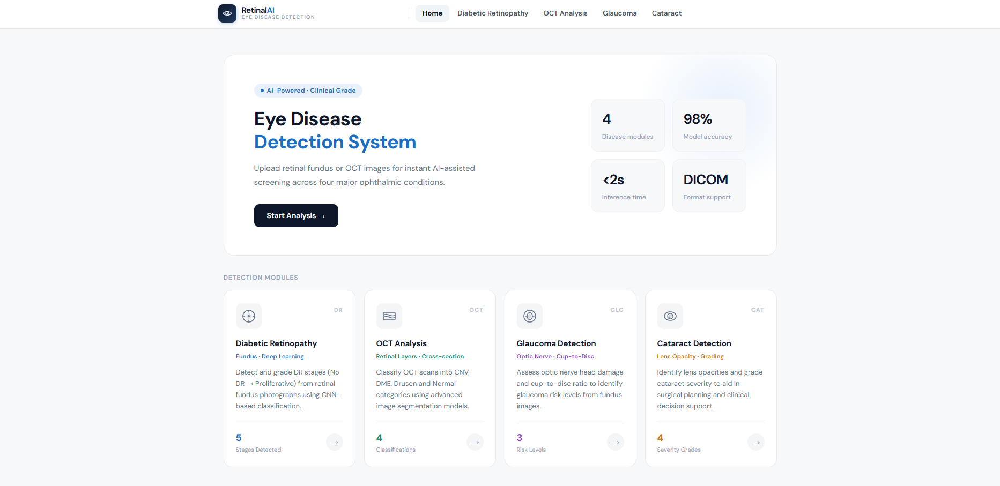

# 👁️ AI-Driven Multi-Disease Diagnosis of Diabetes-Related Eye Disorders


## 📌 Project Overview

Diabetes-related eye diseases are among the leading causes of preventable blindness worldwide. Early diagnosis is critical, but manual retinal image analysis is time-consuming, resource-intensive, and dependent on specialist expertise.

This project introduces an AI-Driven Multi-Disease Diagnosis Framework that automatically detects and analyzes multiple diabetic eye diseases using Deep Learning and Explainable AI (XAI).

The system integrates specialized AI modules for:

**🔴 Diabetic Retinopathy (DR)**
**🟢 Glaucoma**
**🟡 Cataract**
**🔵 Diabetic Macular Edema (DME)**

Unlike traditional black-box AI systems, this framework provides:

**✅ Disease severity prediction**
**✅ Risk score estimation**
**✅ Confidence analysis**
**✅ Explainable visual outputs using Grad-CAM heatmaps**
**✅ Clinically interpretable results**

The proposed solution is designed as a scalable web-based diagnostic support platform for hospitals, screening centers, telemedicine systems, and ophthalmologists.

## 🖥️ System Homepage



## ✨ Key Features

- **🔍 Multi-Disease Detection**
  - Cataract detection
  - Diabetic Retinopathy (DR) detection
  - DME detection
  - Glaucoma detection

- **📊 Severity Classification**
  Predicts disease severity levels such as:
  - Cataract: No / Mild / Moderate / Severe
  - Diabetic Retinopathy (DR): No / Mild / Moderate / Severe / Proliferative
  - DME: NORMAL / DRUSEN / DME / CNV
  - Glaucoma: Normal / Early / Advance

- **🔍 Structural Biomarker Analysis**
Extracts clinically meaningful biomarkers such as:
  - Cataract: VDS assesment
  - Diabetic Retinopathy (DR): Lesion-based indicators
  - DME: Risk score analysis
  - Glaucoma: Cup-to-Disc Ratio (CDR)

- **🧠 Advanced AI Models**
  - EfficientNet-based architectures for optimal accuracy and performance
  - Transfer learning from ImageNet pre-training
  - Optimized inference with CPU/GPU support

- **🎨 Professional User Interface**
  - Clean, intuitive React-based frontend with Tailwind CSS
  - Real-time processing feedback
  - Detailed diagnostic reports with visual explanations
  - Responsive design for mobile and desktop

- **📊 Explainability**
  - Grad-CAM visualization for model interpretability
  - Feature attribution maps
  - Confidence scores for all predictions

## 🏗️ Project Structure

```
R26-IT-043/
├── backend/                          # Flask REST API
│   ├── app.py                       # Main Flask application
│   ├── requirements.txt             # Python dependencies
│   ├── cataract.py                 # Cataract detection module
│   ├── dr.py                       # Diabetic retinopathy module
│   ├── glaucoma_app.py             # Glaucoma detection module
│   ├── oct.py                      # OCT analysis module
│   ├── routes/                     # API endpoints
│   │   ├── cdr.py                 # CDR calculation
│   │   ├── diabetic_retinopathy.py # DR endpoints
│   │   ├── dr_info.py             # DR information
│   │   ├── glaucoma.py            # Glaucoma endpoints
│   │   ├── gradcam.py             # Grad-CAM visualization
│   │   ├── oct.py                 # OCT endpoints
│   │   └── vds.py                 # VDS computation
│   └── models/                    # Pre-trained model weights
│       ├── best_efficientnet_b0_oct.pth
│       ├── best_effb3_cataract_v2.pth
│       ├── best_dr_efficientnetv2s.pth
│       └── glucoma_best_model_b0_clean.pth
│
├── frontend/                        # React + Vite frontend
│   ├── src/
│   │   ├── components/           # React components
│   │   │   ├── DiabeticRetinopathy.jsx
│   │   │   ├── GlaucomaFundusAnalyser.jsx
│   │   │   ├── OCTFundusAnalyser.jsx
│   │   │   ├── VDSFundusAnalyser.jsx
│   │   │   ├── NavBar.jsx
│   │   │   └── Footer.jsx
│   │   ├── services/             # API integration
│   │   │   ├── api_dr.js
│   │   │   ├── api_glaucoma.js
│   │   │   ├── api_cataract.js
│   │   │   └── api_oct.js
│   │   ├── App.jsx
│   │   └── main.jsx
│   ├── package.json
│   └── tailwind.config.js
│
└── README.md                        # This file
```

## 🛠️ Tech Stack

### Backend
- **Framework**: Flask 3.0+
- **Deep Learning**: PyTorch 2.0+, TorchVision
- **Model Architecture**: EfficientNet (B0, B3, V2S)
- **Model Interpretability**: Grad-CAM
- **Image Processing**: OpenCV, Pillow, Albumentations, scikit-image
- **Server**: Gunicorn
- **Utilities**: NumPy, Matplotlib, python-dotenv

### Frontend
- **Framework**: React 19.1+
- **Build Tool**: Vite
- **Styling**: Tailwind CSS
- **HTTP Client**: Axios
- **Routing**: React Router DOM
- **Icons**: Lucide React
- **Linting**: ESLint

## 🚀 Getting Started

### Prerequisites
- Python 3.9+
- Node.js 18+
- Git
- CUDA Toolkit (optional, for GPU acceleration)

### Backend Setup

1. **Clone and navigate to backend**
   ```bash
   cd backend
   ```

2. **Create virtual environment**
   ```bash
   python -m venv venv
   source venv/bin/activate  # On Windows: venv\Scripts\activate
   ```

3. **Install dependencies**
   ```bash
   pip install -r requirements.txt
   ```

4. **Run the Flask server**
   ```bash
   python app.py      # Development
   # or
   gunicorn -w 4 -b 0.0.0.0:5000 app:app  # Production
   ```
   Server will start on `http://localhost:5000`

### Frontend Setup

1. **Navigate to frontend**
   ```bash
   cd frontend
   ```

2. **Install dependencies**
   ```bash
   npm install
   ```

3. **Start development server**
   ```bash
   npm run dev
   ```
   Frontend will be available at `http://localhost:5173`

4. **Production build**
   ```bash
   npm run build
   ```

## 📡 API Endpoints

### Cataract Detection
- `POST /api/vds/analyze` - Predict cataract severity and visibility degradation score
- `GET /api/vds/health` - Check cataract backend health status

### Diabetic Retinopathy
- `POST /api/analyze` - Predict diabetic retinopathy severity from retinal fundus images
- `GET /api/health` - Check DR backend health status

### OCT Analysis
- `POST /api/predict` - Analyze OCT retinal images and predict disease class
- `GET /api/health` - Check OCT backend health status

### Glaucoma Detection
- `POST /api/glaucoma/predict` - Predict glaucoma severity stage
- `GET /api/glaucoma/classes` - Get supported glaucoma classes
- `POST /api/cdr/analyse` - Calculate Cup-to-Disc Ratio (CDR) and glaucoma risk
- `GET /api/health` - Check glaucoma backend health status

## 🧠 Models Overview

| Disease | Architecture | Accuracy | Input Size | Weights |
|---------|-------------|----------|-----------|---------|
| Diabetic Retinopathy | EfficientNetV2S | High | 224x224 | `best_dr_efficientnetv2s.pth` |
| Cataract | EfficientNet-B3 | High | 224x224 | `best_effb3_cataract_v2.pth` |
| Glaucoma | EfficientNet-B0 | High | 224x224 | `glucoma_best_model_b0_clean.pth` |
| OCT | EfficientNet-B0 | High | 224x224 | `best_efficientnet_b0_oct.pth` |

## 💻 Usage Example

### Python Backend Example
```python
from PIL import Image
import torch
from torchvision import transforms

# Load image
image = Image.open('fundus_image.jpg')

# Apply preprocessing
transform = transforms.Compose([
    transforms.Resize((224, 224)),
    transforms.ToTensor(),
    transforms.Normalize(mean=[0.485, 0.456, 0.406],
                        std=[0.229, 0.224, 0.225])
])

# Get prediction
with torch.no_grad():
    output = model(transform(image).unsqueeze(0))
    prediction = torch.argmax(output, dim=1)
```

### React Frontend Example
```javascript
import axios from 'axios';

const predictDR = async (imageFile) => {
  const formData = new FormData();
  formData.append('image', imageFile);
  
  try {
    const response = await axios.post(
      'http://localhost:5000/api/dr/predict',
      formData,
      { headers: { 'Content-Type': 'multipart/form-data' } }
    );
    console.log('Prediction:', response.data);
  } catch (error) {
    console.error('Error:', error);
  }
};
```

## 📊 Model Interpretability

The system includes Grad-CAM visualization to provide explainability:

```python
# Generate attention maps showing which regions influenced the prediction
attention_map = gradcam(image, target_layer='features.top_features')
```

## 🔐 Privacy & Security

- All processing done server-side; images not stored
- CORS properly configured for frontend-backend communication
- Input validation on all endpoints
- Suitable for HIPAA-compliant deployments with proper configuration

## 🚀 Future Improvements

- Real-time mobile screening application
- Cloud-based deployment
- Integration with hospital EHR systems
- Federated learning for privacy-preserving AI
- Cross-hospital dataset generalization
- Multi-language clinical reporting

## 📝 License

This project is licensed under the MIT License - see the LICENSE file for details.

## ⚠️ Disclaimer

This system is designed as a **diagnostic aid** and should **not** be used as the sole basis for clinical decision-making. Always consult with qualified ophthalmologists for professional medical diagnosis and treatment.

## 👨‍💻 Research Team
**Project Title**

- AI-Driven Multi-Disease Diagnosis of Diabetes-Related Eye Disorders

**Research Group**

- R26-IT-043

**Research Cluster**

- SST – Software Systems & Technologies

**Institution**

- Sri Lanka Institute of Information Technology (SLIIT)

## 📧 Contact & Support

For questions, issues, or collaborations, please reach out through the project repository.

## 🙏 Acknowledgments

- Built with state-of-the-art deep learning models
- Inspired by modern medical imaging practices
- Thanks to the PyTorch and React communities

---

**Last Updated**: May 2026 | **Version**: 1.0.0